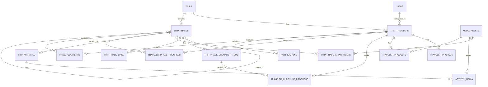

# ERD Conceitual

## Núcleo de identidade

### `users`

Representa qualquer pessoa autenticada no sistema.

Atributos principais:

- `id`
- `phone`
- `full_name`
- `email`
- `status`
- `role`

Observação:

- usuários internos do backoffice existem aqui
- usuários internos não entram em `trip_travelers` nesta primeira versão

### `trips`

Representa a viagem.

Atributos principais:

- `id`
- `slug`
- `name`
- `short_name`
- `description`
- `start_date`
- `end_date`
- `status`
- `default_timezone`

### `trip_travelers`

Representa o usuário dentro da viagem.

Atributos principais:

- `id`
- `trip_id`
- `user_id`
- `display_name`
- `enrollment_status`
- `joined_at`

## Cadastro do viajante

### `traveler_profiles`

Perfil cadastral do viajante na viagem.

Atributos principais:

- `id`
- `trip_traveler_id`
- `preferred_name`
- `date_of_birth`
- `gender`
- `passport_*`
- `dietary_*`
- `plus_one_*`
- `needs_*`

### `traveler_products`

Informações comerciais/operacionais mostradas em `Products & Payment`.

Atributos principais:

- `id`
- `trip_traveler_id`
- `package_name`
- `room_type`
- `amount_paid_usd`
- `purchased_addons_summary`
- `service_agreement_media_asset_id`

## Conteúdo da viagem

### `trip_phases`

Representa tanto fases pré-viagem quanto dias da viagem.

Atributos principais:

- `id`
- `trip_id`
- `parent_phase_id`
- `phase_type`
- `slug`
- `title`
- `subtitle`
- `icon`
- `short_description`
- `detailed_description`
- `sort_order`
- `starts_at`
- `ends_at`
- `is_locked_by_default`
- `is_visible`

### `trip_phase_checklist_items`

Itens de checklist de uma fase.

### `trip_phase_links`

Links úteis de uma fase.

### `media_assets`

Representa o ativo físico em storage externo.

### `trip_phase_attachments`

Anexos ligados à fase.

### `trip_activities`

Atividades de uma fase.

### `activity_media`

Mídias de uma atividade.

## Estado e interação do viajante

### `traveler_checklist_progress`

Estado do viajante em cada item de checklist.

### `traveler_phase_progress`

Estado agregado do viajante em cada fase.

### `phase_comments`

Comentários do viajante na fase.

Regra:

- comentários existem apenas no nível de fase nesta primeira versão

### `notifications`

Notificações para o viajante.

## Mermaid ER

