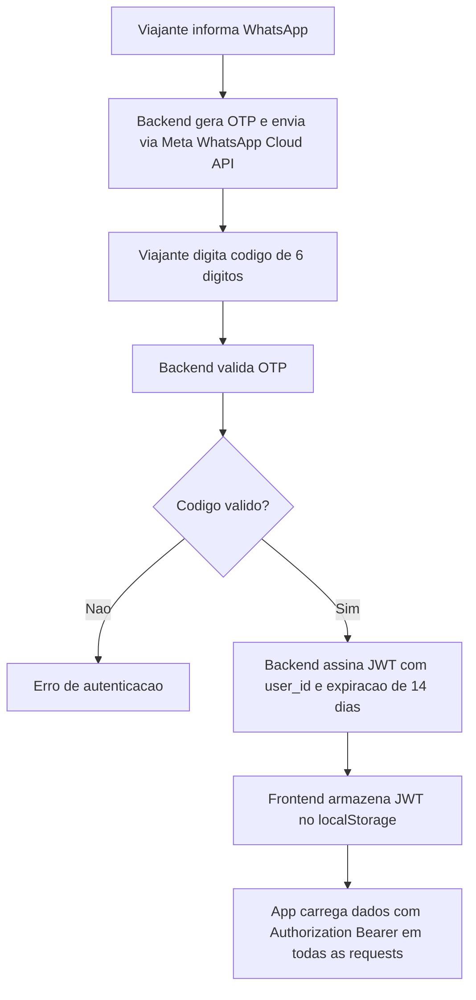
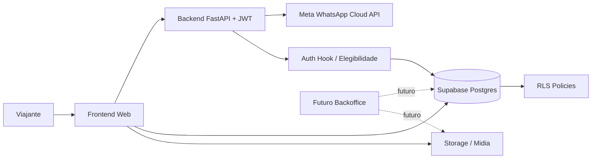
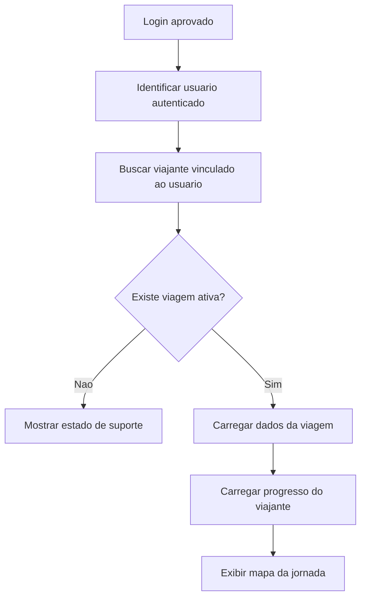
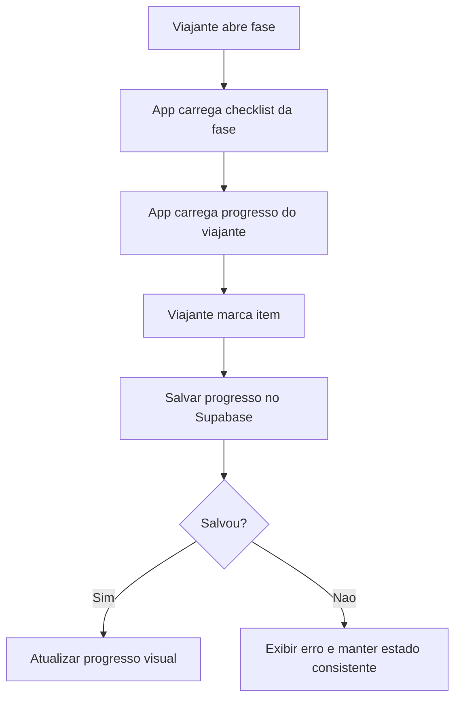
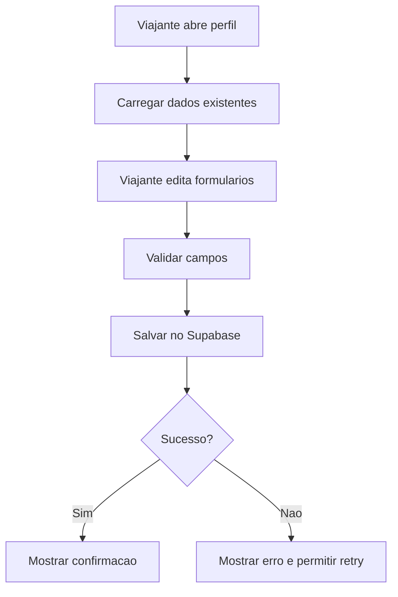
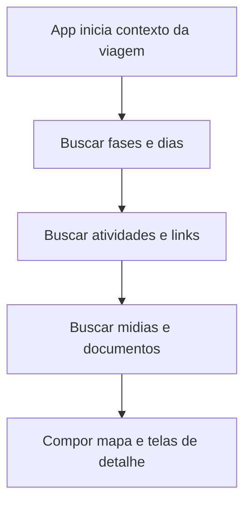

# Requisitos e System Design Inicial

## Contexto

O projeto Parrot Trips deve ser reiniciado a partir de requisitos de produto e system design, sem tratar o modelo de banco de dados existente neste repositorio como fonte de verdade. O frontend atual serve apenas como referencia do produto imaginado: um app para viajantes acompanharem uma experiencia de viagem, preencherem informacoes pessoais, consultarem roteiro, atividades, documentos e progresso.

A versao inicial deve focar no app do viajante. Uma area administrativa da Parrot Trips deve ser considerada como evolucao futura, mas nao faz parte do escopo obrigatorio da v1.

## Objetivo da V1

Entregar um app web para o viajante autenticado acompanhar uma unica viagem ativa, com jornada visual, fases pre-viagem, dias da viagem, checklists, roteiro, atividades, album, perfil, dados de compra/pagamento e contrato de servico.

## Premissas Aprovadas

- Supabase sera a fonte unica da verdade para dados da aplicacao.
- Dados existentes decorrentes de compras de viagens devem ser reaproveitados no Supabase.
- O viajante complementa seus dados no app por meio de formularios.
- A v1 tera apenas app do viajante.
- A area administrativa fica fora da v1, mas o design deve permitir sua criacao futura.
- Cada usuario tera apenas uma viagem ativa no app.
- Nao havera seletor de multiplas viagens na v1.
- A autenticacao usa WhatsApp OTP proprio via Meta WhatsApp Cloud API com JWT como mecanismo de sessao.
- Apenas telefones previamente autorizados por compra, convite ou participacao em viagem podem iniciar login.
- O conteudo da viagem nao deve depender de dados hardcoded no frontend como fonte principal.

## Fora de Escopo da V1

- Backoffice/area administrativa para o time Parrot Trips.
- Suporte a multiplas viagens ativas por usuario.
- Marketplace completo de add-ons dentro do app.
- Chat de grupo.
- Missoes, leaderboard e gamificacao avancada.
- Notificacoes push nativas.
- Comentarios colaborativos, salvo se forem reavaliados como obrigatorios depois.
- Migracao do modelo de banco atual como base obrigatoria.

## Usuarios

### Viajante

Pessoa que comprou ou foi adicionada a uma viagem da Parrot Trips. Usa o app para autenticar, consultar a experiencia, acompanhar progresso, preencher formularios, consultar produtos contratados e acessar documentos.

### Time Parrot Trips

Usuario operacional futuro. Na v1, nao tera interface propria dentro do app. Seus dados poderao ser inseridos, importados ou integrados diretamente no Supabase por processos internos.

## Requisitos Funcionais

### RF01 - Login por WhatsApp

O viajante deve conseguir entrar no app usando seu numero de WhatsApp.

Critérios:
- O app deve solicitar o telefone em formato internacional ou normaliza-lo para esse formato.
- O sistema deve validar se o telefone pertence a um viajante autorizado.
- Se o telefone nao for autorizado, o login deve ser bloqueado.
- Se o telefone for autorizado, um OTP deve ser enviado via WhatsApp.
- O viajante deve informar o codigo recebido.
- Codigo valido deve criar uma sessao autenticada no Supabase.

### RF02 - Carregar Viagem Ativa

Apos login, o app deve carregar automaticamente a unica viagem ativa vinculada ao viajante.

Critérios:
- O viajante nao deve escolher entre multiplas viagens na v1.
- Se nao houver viagem ativa, o app deve exibir um estado controlado com orientacao de suporte.
- Todas as telas principais devem operar no contexto dessa viagem ativa.

### RF03 - Mapa da Jornada

O app deve exibir uma visao principal da jornada da viagem.

Critérios:
- Exibir fases pre-viagem e dias/fases in-trip.
- Indicar progresso do viajante.
- Indicar fase atual do viajante.
- Permitir abrir detalhes de cada fase ou dia.
- Exibir informacoes resumidas da viagem, como nome e datas.

### RF04 - Detalhes de Fase Pre-Viagem

O viajante deve consultar instrucoes de cada fase pre-viagem.

Critérios:
- Exibir titulo, subtitulo, descricao e instrucoes detalhadas.
- Exibir links uteis.
- Exibir checklist associado.
- Permitir marcar fase como concluida quando aplicavel.

### RF05 - Checklist por Fase

O viajante deve marcar itens de checklist como concluidos.

Critérios:
- O progresso deve ser salvo por viajante e por viagem.
- O estado salvo deve ser recuperado ao reabrir o app.
- Falhas de salvamento devem ser tratadas sem corromper o estado visual.

### RF06 - Detalhes dos Dias da Viagem

O viajante deve consultar os dias da viagem com roteiro e contexto.

Critérios:
- Exibir nome do dia, data ou subtitulo e descricao.
- Listar atividades do dia em ordem.
- Diferenciar atividades incluidas, opcionais, sugeridas e logisticas.
- Exibir horarios, duracao, descricao, informacoes praticas, preco quando houver e imagens.

### RF07 - Atividades Opcionais

O app deve mostrar atividades opcionais e seus detalhes.

Critérios:
- Atividades opcionais devem ser claramente identificadas.
- Precos devem ser exibidos quando existirem.
- A compra ou reserva pode ser apenas linkada ou sinalizada na v1, sem checkout completo obrigatorio.

### RF08 - Album da Viagem

O app deve exibir um album visual associado a dias ou atividades.

Critérios:
- Exibir fotos ja associadas ao dia/atividade.
- Permitir adicionar foto, se essa decisao for mantida para v1.
- Registrar autor, legenda e contexto da foto quando aplicavel.
- Definir posteriormente se o armazenamento sera Supabase Storage, Google Drive ou integracao hibrida.

### RF09 - Perfil do Viajante

O viajante deve visualizar e editar informacoes do proprio perfil.

Campos candidatos:
- Nome preferido.
- Email.
- Data de nascimento.
- Genero.
- Dados de passaporte.
- Restricoes alimentares.
- Enjoo em barco.
- Acompanhante.
- Necessidade de ajuda com voos internacionais.
- Necessidade de ajuda com seguro viagem.
- Informacoes sobre o que tornaria a viagem inesquecivel.
- Aceite para receber atualizacoes sobre add-ons.

### RF10 - Produtos e Pagamento

O viajante deve consultar informacoes relacionadas ao produto contratado.

Critérios:
- Exibir pacote contratado.
- Exibir valor pago quando disponivel.
- Exibir tipo de quarto ou configuracao equivalente.
- Exibir add-ons comprados.
- Dados sensiveis de pagamento nao devem ser expostos alem do necessario.

### RF11 - Contrato de Servico

O viajante deve acessar seu contrato ou acordo de servico.

Critérios:
- Exibir estado "nao disponivel" quando ainda nao houver contrato.
- Quando disponivel, permitir abrir o documento.
- O documento deve estar associado ao viajante e a viagem ativa.

## Requisitos Nao Funcionais

### RNF01 - Seguranca e Privacidade

O viajante so deve acessar dados da propria viagem e do proprio perfil. Dados pessoais, passaporte, saude, pagamento e contrato exigem protecao forte via autenticacao, autorizacao e politicas de acesso.

### RNF02 - Row Level Security

O Supabase deve usar RLS para garantir que usuarios autenticados so acessem linhas permitidas.

### RNF03 - Mobile First

O app deve ser otimizado para uso mobile durante a viagem.

### RNF04 - Disponibilidade Durante a Viagem

Fluxos essenciais devem ser confiaveis em conexoes moveis instaveis. O app deve tratar loading, erro e retry de forma clara.

### RNF05 - Auditabilidade

Alteracoes importantes feitas pelo viajante, como perfil, checklist e upload de fotos, devem ter timestamps e relacao com o usuario autenticado.

### RNF06 - Evolucao para Backoffice

O modelo de dados e as APIs devem permitir que uma futura area administrativa cadastre e edite viagens, fases, atividades, viajantes, documentos e produtos sem refazer a arquitetura.

### RNF07 - Internacionalizacao Inicial

O app pode iniciar em ingles por causa do publico viajante atual, mas a arquitetura de conteudo deve evitar acoplamento desnecessario a textos hardcoded.

## Autenticacao e Autorizacao

### Decisao

Usar WhatsApp OTP proprio via Meta WhatsApp Cloud API com JWT como mecanismo de sessao. Implementado e validado end-to-end — detalhes em `03-autenticacao-opcoes.md`.

### Regra de Elegibilidade

O sistema deve permitir login apenas para telefones previamente associados a uma compra, convite ou participacao em viagem.

### Fluxo de Autenticacao

## Fonte da Verdade e Dados

Supabase deve centralizar:
- viajantes;
- telefones autorizados;
- usuarios autenticados;
- viagens;
- participacao do viajante na viagem;
- fases da jornada;
- dias da viagem;
- atividades;
- checklists;
- progresso;
- formularios de perfil;
- produtos contratados;
- add-ons comprados;
- documentos;
- referencias de midia;
- uploads ou referencias de fotos.

Dados de compra ja existentes no Supabase devem alimentar a elegibilidade de login e a vinculacao inicial do viajante com sua viagem ativa.

## System Design Inicial

Os fluxos abaixo tambem estao separados em `PRODUCT_AND_SYSTEM_DESIGN/diagrams/` como arquivos `.mmd`, para permitir exportacao para SVG/PNG e uso em apresentacoes.

SVGs gerados:
- [Fluxo de autenticacao](diagrams/auth-flow.svg)
- [Arquitetura conceitual](diagrams/architecture-overview.svg)
- [Fluxo apos login](diagrams/app-load-flow.svg)
- [Fluxo de checklist](diagrams/checklist-flow.svg)
- [Fluxo de perfil](diagrams/profile-flow.svg)
- [Fluxo de conteudo da viagem](diagrams/trip-content-flow.svg)

### Componentes

- **Frontend Web**: app React/Vite mobile-first usado pelo viajante.
- **WhatsApp Cloud API (Meta)**: envio de OTP via WhatsApp com backend proprio.
- **JWT**: sessao de 14 dias gerenciada pelo backend.
- **Supabase Postgres**: fonte unica da verdade para dados relacionais.
- **Supabase RLS**: camada principal de autorizacao por linha.
- **Supabase Storage ou integracao de midia**: armazenamento ou referencia para fotos/documentos.
- **Edge Functions / Server-side Functions**: logica sensivel, integracoes, hooks de autenticacao e tarefas futuras.
- **Futuro Backoffice**: interface administrativa posterior para gerenciar conteudo e operacao.

### Arquitetura Conceitual

### Fluxo Apos Login

### Fluxo de Checklist

### Fluxo de Perfil

### Fluxo de Conteudo da Viagem

## Decisoes Abertas

- Como os dados de compra chegam ou sao sincronizados no Supabase.
- Se o app acessara Supabase diretamente em todos os fluxos ou se parte passara por Edge Functions.
- Como sera feita a elegibilidade exata do login com Supabase Auth Hooks.
- Qual sera o provedor definitivo para documentos e fotos: Supabase Storage, Google Drive ou estrategia hibrida.
- Se upload de foto pelo viajante entra mesmo na v1 ou se o album sera apenas leitura no primeiro release.
- Como produtos, add-ons e pagamentos serao sincronizados com sistemas de venda existentes.
- Quais campos de perfil sao obrigatorios, opcionais ou somente leitura.
- Qual politica de retencao e exposicao para dados sensiveis de passaporte, saude e pagamento.

## Perguntas Pendentes

1. Quais dados de compra ja existem hoje no Supabase?
2. Existe um identificador confiavel entre compra, viajante, telefone e viagem?
3. O telefone de compra sempre sera o WhatsApp usado para login?
4. O time Parrot Trips ja usa alguma planilha, sistema de checkout ou CRM como origem operacional?
5. Fotos do album devem ser enviadas pelos viajantes na v1 ou apenas exibidas?
6. Contratos de servico ja existem em algum sistema externo?
7. Add-ons devem ser apenas exibidos ou tambem comprados/reservados pelo app na v1?
8. Quais informacoes do perfil devem ser obrigatorias antes da viagem?
9. O app precisa funcionar parcialmente offline?
10. A experiencia sera apenas em ingles na v1?
