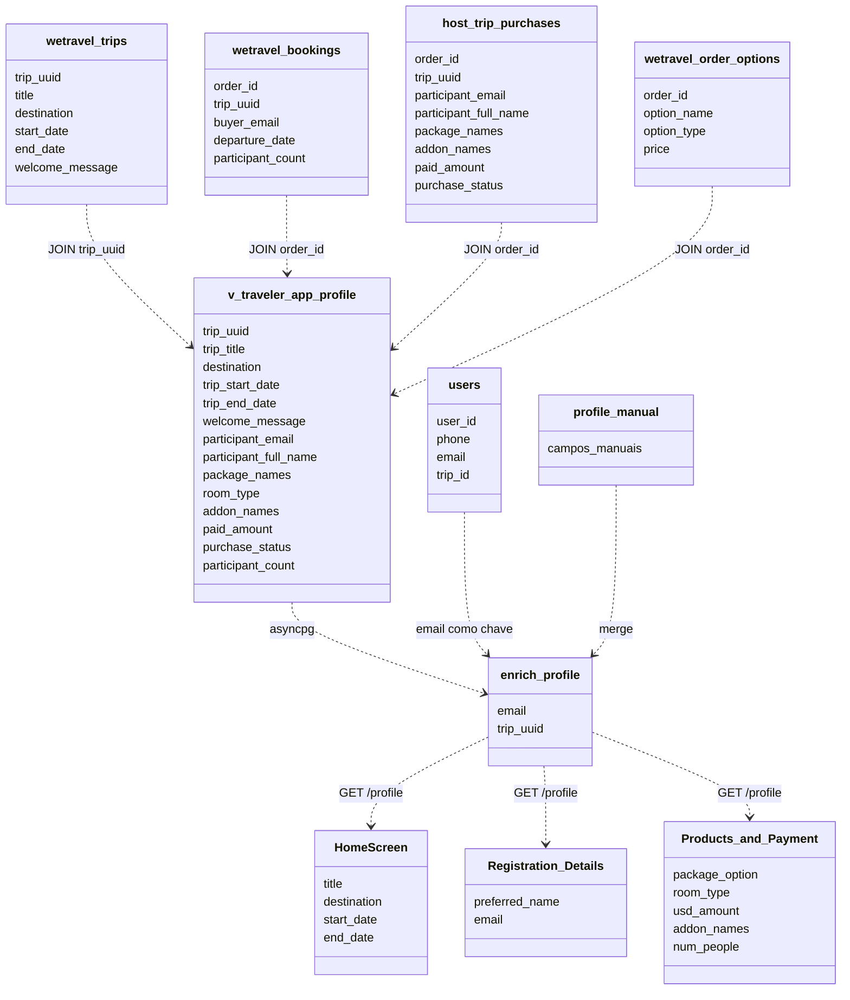

# Mapeamento de Dados: Supabase para o Frontend

## Contexto

O Supabase ja contem dados de compras e participacao de viajantes provenientes da plataforma WeTravel. Esses dados devem alimentar automaticamente campos do app, reduzindo a carga de preenchimento manual pelo viajante e garantindo consistencia com os dados de origem da compra.

Este documento mapeia quais tabelas e campos do Supabase correspondem a quais telas e campos do frontend.

## Tabelas Envolvidas

### wetravel_trips

Contem os dados gerais de cada viagem cadastrada na WeTravel.

Campos relevantes:
- `trip_uuid` — identificador unico da viagem
- `title` — nome da viagem
- `destination` — destino da viagem
- `start_date` — data de inicio
- `end_date` — data de termino
- `welcome_message` — mensagem de boas-vindas configurada pelo organizador
- `listing_status` — status da viagem (ex: private, published)

### wetravel_bookings

Contem os dados de cada reserva feita por um comprador na WeTravel.

Campos relevantes:
- `order_id` — identificador da reserva
- `trip_uuid` — referencia a viagem
- `buyer_email` — email do comprador
- `buyer_full_name` — nome do comprador
- `departure_date` — data de partida da reserva
- `trip_end_date` — data de termino da reserva
- `participant_count` — numero de participantes na reserva
- `participants_json` — lista de participantes em formato JSON

### host_trip_purchases

View que consolida compras por reserva, sem desdobramento por participante individual.

Campos relevantes:
- `order_id`, `trip_uuid`, `trip_title`
- `buyer_email`, `buyer_full_name`
- `package_names` — nome do pacote contratado (ex: "Early Bird | Triple Shared Room")
- `addon_names` — add-ons comprados separados por virgula
- `paid_amount`, `pending_amount`
- `purchase_status`, `payment_status`
- `is_cancelled`

### host_trip_participants

View que desdobra participantes a partir de `participants_json` de cada reserva.

Campos relevantes:
- `trip_uuid`, `trip_title`, `order_id`
- `participant_email` — email do participante individual
- `participant_full_name` — nome do participante
- `buyer_email`, `buyer_full_name` — dados do comprador da reserva
- `package_names` — pacote da reserva
- `addon_names` — add-ons da reserva
- `paid_amount`, `pending_amount`
- `purchase_status`, `payment_status`
- `is_cancelled`

### wetravel_order_options

Detalha as opcoes (pacotes e add-ons) de cada reserva.

Campos relevantes:
- `order_id`
- `option_name` — nome da opcao
- `option_type` — tipo (package ou addon)
- `price`, `deposit_amount`

## View a Criar: v_traveler_app_profile

Para simplificar o acesso pelo backend, deve ser criada uma view no Supabase que consolide os campos necessarios para o app em uma unica consulta por participante e viagem.

```sql
-- Referencia conceitual — implementacao exata a definir
SELECT
  t.trip_uuid,
  t.title            AS trip_title,
  t.destination,
  t.start_date       AS trip_start_date,
  t.end_date         AS trip_end_date,
  t.welcome_message,
  p.participant_email,
  p.participant_full_name,
  p.buyer_email,
  p.buyer_full_name,
  p.package_names,
  TRIM(SPLIT_PART(p.package_names, '|', 2)) AS room_type,
  p.addon_names,
  p.paid_amount,
  p.pending_amount,
  p.purchase_status,
  p.payment_status,
  p.is_cancelled,
  b.participant_count
FROM host_trip_participants p
JOIN wetravel_trips t ON t.trip_uuid = p.trip_uuid
JOIN wetravel_bookings b ON b.order_id = p.order_id
```

Chave de consulta: `participant_email` + `trip_uuid`.

## Diagrama de Fluxo



## Mapeamento por Tela e Campo

### HomeScreen

| Campo no frontend | Campo na view | Observacao |
|---|---|---|
| Nome da viagem | `trip_title` | Hoje hardcoded no frontend |
| Destino | `destination` | Hoje hardcoded no frontend |
| Data de inicio | `trip_start_date` | Hoje hardcoded no frontend |
| Data de fim | `trip_end_date` | Hoje hardcoded no frontend |

### ProfileScreen — Registration Details

| Campo no frontend | Campo na view | Editavel pelo viajante? |
|---|---|---|
| `preferred_name` | `participant_full_name` | Sim — viajante pode usar apelido |
| `email` | `participant_email` | Nao — somente leitura, origem WeTravel |

### ProfileScreen — Products and Payment

| Campo no frontend | Campo na view | Editavel pelo viajante? |
|---|---|---|
| `package_option` | `package_names` | Nao — somente leitura |
| `transfer_platform` (Room Type) | `room_type` | Nao — extraido de `package_names` |
| `usd_amount` | `paid_amount` | Nao — somente leitura |
| `proof_of_transfer` (Add-ons) | `addon_names` | Nao — somente leitura |
| `num_people` | `participant_count` | Nao — somente leitura |

## Campos Sem Origem no Supabase

Os campos abaixo nao existem nas tabelas do Supabase e devem ser preenchidos pelo viajante no app:

- `dob`, `gender`
- `first_name_passport`, `last_name_passport`, `passport_country`, `passport_number`, `passport_issue_date`, `passport_expiration_date`
- `dietary_restrictions_yn`, `dietary_restrictions_desc`
- `seasickness_yn`
- `plus_one_yn`, `plus_one_name`, `plus_one_email`
- `arrival_date`, `arrival_time`, `arrival_flight`
- `departure_date`, `departure_time`, `departure_flight`
- `intl_flights_help_yn`, `intl_flights_help_details`
- `travel_insurance_help_yn`
- `unforgettable_trip_details`
- `receive_addon_updates`

Os campos abaixo sao preenchidos pelo time Parrot Trips, nao pelo viajante:

- `service_agreement_url`
- `esim_qr_image`
- `roommate_user_id`

## Mecanismo de Ligacao: Telefone para Email

O app autentica o viajante por telefone. O Supabase identifica participantes por email. A ligacao entre os dois deve ser feita da seguinte forma:

1. No primeiro acesso apos login, o app solicita o email do viajante caso ainda nao esteja registrado.
2. O backend consulta a view `v_traveler_app_profile` filtrando por `participant_email`.
3. A correspondencia e salva na tabela `users` do backend (campo `email`).
4. Em acessos subsequentes, a ligacao ja existe e o enriquecimento e transparente.

## Decisoes Abertas

- Definir se a view `v_traveler_app_profile` sera criada diretamente no Supabase ou resolvida no backend.
- Definir politica de RLS para a view, garantindo que cada viajante acesse apenas seus proprios dados.
- Definir o que acontece quando `participant_email` difere do email informado no app (ex: email de compra diferente do email pessoal).
- Definir se `room_type` sera extraido via SQL ou no backend.
- Avaliar se `welcome_message` da WeTravel sera exibida no app ou substituida por conteudo proprio.
