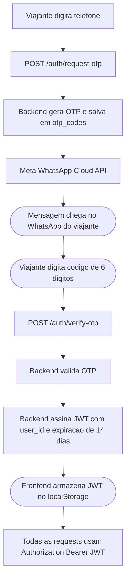

# Autenticacao: Decisao

## Abordagem Adotada

**WhatsApp OTP proprio + JWT**

O sistema de autenticacao usa a Meta WhatsApp Cloud API para enviar o codigo OTP e um JWT assinado como mecanismo de sessao. Esta abordagem foi implementada, testada end-to-end e validada.

## Fluxo



## O que foi implementado

- Backend gera OTP de 6 digitos, salva na tabela `otp_codes` com expiracao de 10 minutos
- Codigo enviado via Meta WhatsApp Cloud API
- Verificacao retorna JWT assinado (HS256, 14 dias de validade)
- Middleware global `JWTAuthMiddleware` protege todas as rotas exceto `/auth/*` e `/healthz`
- Frontend armazena `{ userId, phone, name, token }` no localStorage e injeta `Authorization: Bearer` em todas as chamadas

## Configuracao necessaria em producao

```env
WHATSAPP_PHONE_NUMBER_ID=<id do numero aprovado>
WHATSAPP_ACCESS_TOKEN=<system user token permanente>
WHATSAPP_TEMPLATE_NAME=intripauth
WHATSAPP_TEMPLATE_LANGUAGE=pt_BR
JWT_SECRET=<string aleatoria forte, minimo 32 chars>
```

## Custos

A Meta WhatsApp Business API oferece 1.000 conversas gratuitas por mes. Para grupos de 50 a 200 viajantes, o volume de logins fica confortavelmente dentro dessa franquia.

## Resultado do teste E2E

Documentado em `04-teste-e2e-whatsapp-otp-jwt.md`. Todos os 6 passos passaram:
- OTP entregue via WhatsApp no celular do viajante
- JWT gerado e retornado pelo backend
- Rota protegida sem token retornou 401
- Rota protegida com token valido passou
- Token invalido retornou 401
