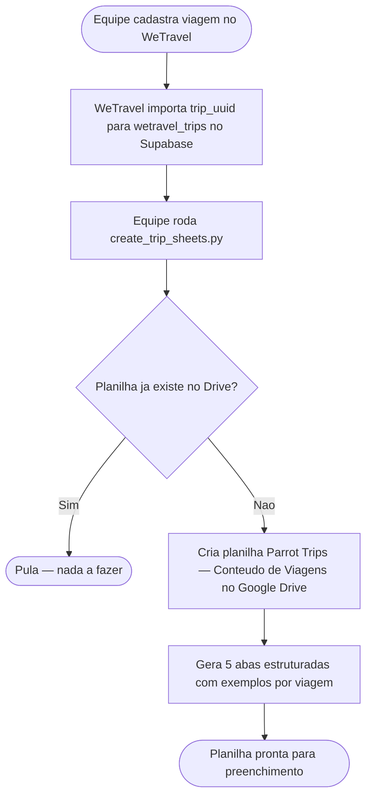
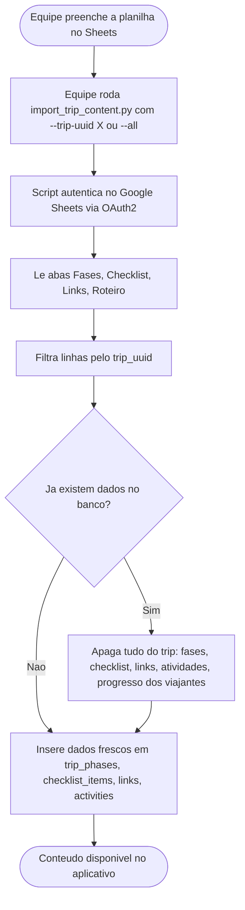
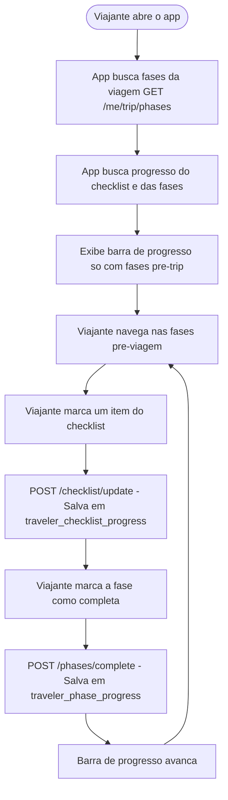
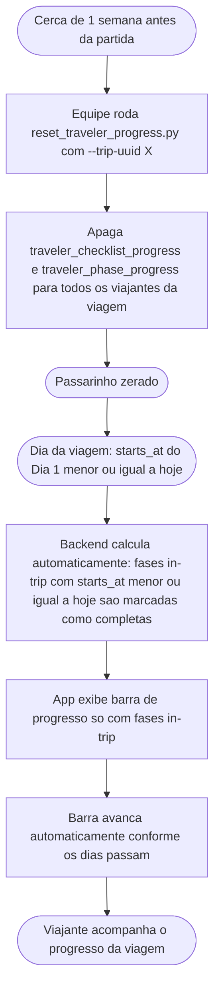
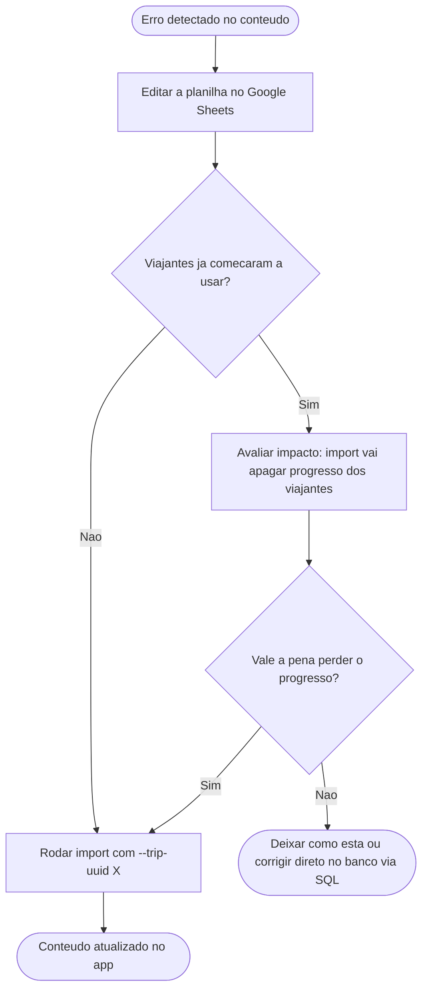
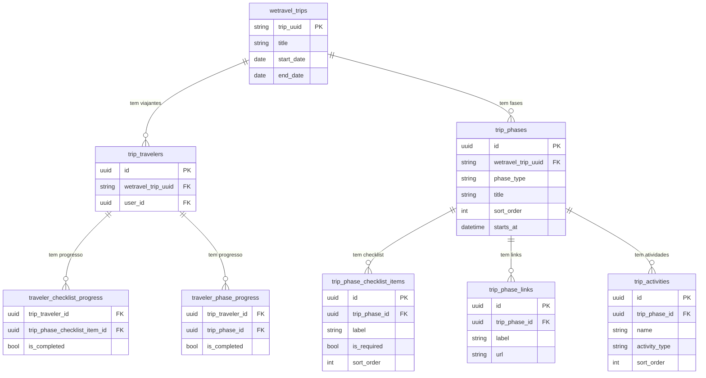
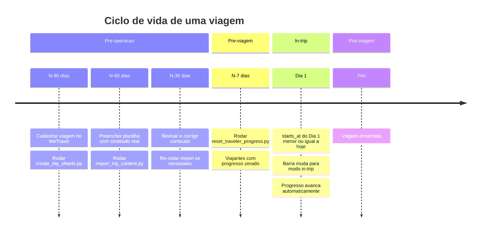

# Fluxo: Planilhas → Supabase → Aplicativo

Documento de referência para entender como o conteúdo de uma viagem sai de uma planilha Google Sheets e chega na tela do viajante.

---

## Visão geral

O sistema tem três camadas principais:

1. **Google Sheets** — onde a equipe Parrot Trips escreve o conteúdo das viagens
2. **Supabase (PostgreSQL)** — banco de dados que armazena tudo de forma estruturada
3. **Aplicativo** — o que o viajante vê e com o qual interage

A comunicação entre essas camadas é feita por scripts Python rodados manualmente pela equipe:
- `create_trip_sheets.py` — cria a planilha estruturada no Drive
- `import_trip_content.py` — lê a planilha preenchida e envia os dados para o Supabase

---

## Fluxo 1 — Criação e preenchimento da planilha

Este fluxo acontece uma vez por temporada, quando novas viagens são cadastradas.



### As 5 abas da planilha

| Aba | Conteúdo | Importada? |
|---|---|---|
| **Viagens** | Lista de trip_uuid, nome e datas | Não — só referência |
| **Fases** | Uma linha por fase pré-trip (visa, vacinas, mala, docs...) | Sim |
| **Checklist** | Uma linha por item de checklist | Sim |
| **Links** | Uma linha por link útil | Sim |
| **Roteiro** | Uma linha por atividade de cada dia | Sim |

Cada aba tem `trip_uuid` como primeira coluna para identificar a qual viagem cada linha pertence.

---

## Fluxo 2 — Importação para o Supabase

Este fluxo acontece sempre que o conteúdo de uma viagem é finalizado ou atualizado na planilha.



### O que é apagado e reinserido a cada import

O import é **destrutivo e idempotente** — pode rodar quantas vezes quiser com o mesmo resultado final:

```
trip_phases
  -> trip_phase_checklist_items
  -> trip_phase_links
  -> trip_activities
  -> traveler_checklist_progress  (progresso dos viajantes)
  -> traveler_phase_progress      (progresso dos viajantes)
```

> Atencao: Rodar o import apaga o progresso salvo dos viajantes para aquela viagem. Fazer isso depois que viajantes ja comecaram a usar o app vai resetar o progresso deles.

---

## Fluxo 3 — O viajante usa o aplicativo (pré-viagem)

Durante o período pré-viagem, o viajante vai marcando as tarefas conforme se prepara.



---

## Fluxo 4 — Reset antes da viagem + modo in-trip

Uma semana antes da viagem, a equipe reseta o progresso para que o passarinho comece do zero no roteiro.



### Como o avanço automático funciona

Não há nenhuma ação manual necessária durante a viagem. A lógica é:

```
Para cada fase in-trip:
  se starts_at <= agora  ->  fase completa (calculado no backend, nao salvo no banco)
  se starts_at > agora   ->  fase pendente
```

O `current_phase_id` de cada viajante é o primeiro dia que ainda não começou — ou seja, o próximo dia da viagem.

---

## Fluxo 5 — Atualização de conteúdo em produção

Quando é necessário corrigir ou atualizar o conteúdo de uma viagem que já está no ar.



---

## Estrutura de dados no Supabase



---

## Resumo dos scripts disponíveis

| Script | Quando usar | Comando |
|---|---|---|
| `create_trip_sheets.py` | Ao adicionar novas viagens — cria estrutura na planilha | `poetry run python scripts/create_trip_sheets.py --folder-id ID --use-adc` |
| `import_trip_content.py` | Após preencher a planilha — envia para o Supabase | `poetry run python scripts/import_trip_content.py --all` |
| `reset_traveler_progress.py` | Cerca de 1 semana antes da viagem — zera progresso dos viajantes | `poetry run python scripts/reset_traveler_progress.py --trip-uuid X` |
| `reset_trip_content.py` | Para apagar fases e atividades do banco e recomeçar do zero | `poetry run python scripts/reset_trip_content.py --trip-uuid X` |

---

## Calendário operacional sugerido


