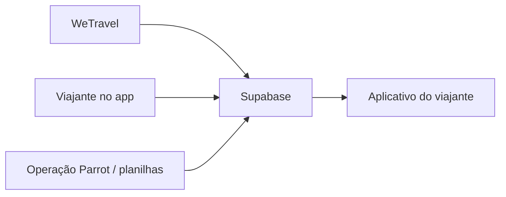

# Mapeamento do Profile do Viajante

## Objetivo

Este documento explica, em linguagem direta, de onde vem cada informação exibida ou preenchida no **Profile do viajante**.

A regra geral é:

- **WeTravel** informa dados da compra, pacote, pagamento e add-ons.
- **Viajante** informa ou completa dados pessoais, passaporte, saúde, acompanhante e preferências.
- **Planilhas da operação** devem conseguir alimentar todo conteúdo não pessoal: cards, links, roteiro, atividades, contatos, tarefas e materiais.
- **Parrot / operação** é dona dos dados da viagem, roteiro, service agreement e conteúdos operacionais.
- **App** apenas mostra ou grava esses dados no lugar correto; ele não deve inventar informação.

## Fluxo Resumido

## Tela: Registration Details

Esses campos são uma mistura de dados iniciais vindos da WeTravel/conta do usuário e dados completados pelo próprio viajante dentro do app.

A WeTravel ajuda a identificar quem é o viajante e a qual viagem ele pertence. Depois disso, o viajante completa as informações pessoais que a operação precisa.

Quando o viajante clica em **Save Profile**, o app envia os dados editáveis para o backend, e o backend grava principalmente na tabela `traveler_profiles`.

| Bloco no app | Campo no app | Chave técnica | Origem do dado | Onde grava hoje | Status |
|---|---|---|---|---|---|
| Basic Info | Preferred Name | `preferred_name` | WeTravel/usuário como base; viajante pode ajustar | `traveler_profiles.preferred_name` e `users.full_name` | Implementado |
| Basic Info | Email | `email` | WeTravel/usuário como base; viajante pode ajustar | `users.email` | Implementado |
| Basic Info | Date of Birth | `dob` | Viajante | `traveler_profiles.date_of_birth` | Implementado |
| Basic Info | Gender | `gender` | Viajante | `traveler_profiles.gender` | Implementado |
| Passport Information | First Name as in passport | `first_name_passport` | Viajante | `traveler_profiles.passport_first_name` | Implementado |
| Passport Information | Last Name as in passport | `last_name_passport` | Viajante | `traveler_profiles.passport_last_name` | Implementado |
| Passport Information | Passport Issuing Country | `passport_country` | Viajante | `traveler_profiles.passport_country` | Implementado |
| Passport Information | Passport Number | `passport_number` | Viajante | `traveler_profiles.passport_number` | Implementado |
| Passport Information | Issue Date | `passport_issue_date` | Viajante | `traveler_profiles.passport_issue_date` | Implementado |
| Passport Information | Expiration Date | `passport_expiration_date` | Viajante | `traveler_profiles.passport_expiration_date` | Implementado |
| Health & Dietary | Dietary Restrictions? | `dietary_restrictions_yn` | Viajante | `traveler_profiles.dietary_restrictions_flag` | Implementado |
| Health & Dietary | Describe your dietary restrictions | `dietary_restrictions_desc` | Viajante | `traveler_profiles.dietary_restrictions_details` | Implementado |
| Health & Dietary | Prone to Seasickness? | `seasickness_yn` | Viajante | `traveler_profiles.seasickness_flag` | Implementado |
| Plus One | Bringing a Plus One? | `plus_one_yn` | Viajante | `traveler_profiles.plus_one_flag` | Implementado |
| Plus One | Plus One Name | `plus_one_name` | Viajante | `traveler_profiles.plus_one_name` | Implementado |
| Plus One | Plus One Email | `plus_one_email` | Viajante | `traveler_profiles.plus_one_email` | Implementado |
| Additional | Need help with international flights? | `intl_flights_help_yn` | Viajante | `traveler_profiles.needs_flight_help_flag` | Implementado |
| Additional | Flight help details | `intl_flights_help_details` | Viajante | `traveler_profiles.flight_help_details` | Implementado |
| Additional | Need help with travel insurance? | `travel_insurance_help_yn` | Viajante | `traveler_profiles.needs_travel_insurance_help_flag` | Implementado |
| Additional | What would make this trip unforgettable? | `unforgettable_trip_details` | Viajante | `traveler_profiles.unforgettable_trip_details` | Implementado |

### Observações importantes

- Registration Details não deve ser preenchido por planilha como fluxo principal, porque contém dados pessoais do viajante.
- O vínculo inicial do viajante com a viagem vem da WeTravel e do telefone/email associado ao usuário.
- Datas precisam estar no formato `YYYY-MM-DD`.
- Campos de sim/não são salvos internamente como booleanos, mas o app envia `yes` ou `no`.
- Se o viajante ainda não tiver profile salvo, o app consegue criar o profile no primeiro save.

## Tela: Products & Payment

Esses campos aparecem no app como **somente leitura**. O viajante não deve editar esses dados pelo app.

Eles vêm da compra feita na WeTravel e são lidos pelo backend a partir das views/tabelas do Supabase.

| Bloco no app | Campo no app | Chave técnica | Origem real | Como o backend preenche hoje | Status |
|---|---|---|---|---|---|
| Your Package | Package Name | `package_option` | WeTravel | `host_trip_participants.package_names` | Implementado |
| Your Package | Amount Paid | `usd_amount` | WeTravel | `host_trip_participants.paid_amount / 100` | Implementado |
| Your Package | Room Type | `transfer_platform` | A definir | Hoje fica vazio; não existe fonte conectada | Lacuna |
| Additional Activities Purchased | Add-on Activities | `proof_of_transfer` | WeTravel | `host_trip_participants.addon_names` | Implementado |

### Observações importantes

- O nome técnico `proof_of_transfer` está ruim para o uso atual. Hoje ele representa **add-ons comprados**, não comprovante de transferência.
- `Room Type` aparece na interface, mas hoje não está vindo da WeTravel nem sendo salvo pelo app.
- Se quisermos que `Room Type` funcione, precisamos definir uma fonte:
  - extrair do nome do pacote, se o pacote sempre tiver essa informação;
  - criar uma coluna específica no Supabase;
  - ou trazer esse dado de algum campo estruturado da WeTravel, caso exista.

## Service Agreement

O service agreement não vem do viajante. Ele é um dado operacional da viagem.

| Campo no app | Chave técnica | Origem do dado | Onde fica hoje | Status |
|---|---|---|---|---|
| View Service Agreement | `service_agreement_url` | Parrot / operação | `wetravel_trips.service_agreement_url` | Implementado |

Hoje o campo pode apontar para:

- uma URL pública normal; ou
- um arquivo privado no GCS usando `gs://...`.

Quando o valor é `gs://...`, o backend gera uma URL assinada temporária para o viajante conseguir abrir o PDF sem deixar o bucket público.

## Dados que vêm da WeTravel

No fluxo atual, a WeTravel é a fonte de verdade para:

| Informação | Onde aparece | Tabela/view usada hoje |
|---|---|---|
| Viagem comprada | vínculo do usuário com a viagem | `trip_travelers` + `wetravel_trips` |
| Nome do pacote | Products & Payment / Package Name | `host_trip_participants.package_names` |
| Add-ons comprados | Products & Payment / Add-on Activities | `host_trip_participants.addon_names` |
| Valor pago | Products & Payment / Amount Paid | `host_trip_participants.paid_amount` |
| Moeda | usado junto do pagamento | `host_trip_participants.currency` |
| Email do participante | vínculo WeTravel -> usuário | `host_trip_participants.participant_email` |
| Telefone do participante | login e vínculo com app | `wetravel_participant_phones.phone` |

Confirmando diretamente: **Your Package** e **Additional Activities Purchased / Add-ons** vêm da WeTravel.

- `Your Package / Package Name` vem de `host_trip_participants.package_names`.
- `Additional Activities Purchased / Add-on Activities` vem de `host_trip_participants.addon_names`.
- `Amount Paid` vem de `host_trip_participants.paid_amount`.
- Esses campos são somente leitura no app.

## Dados que o viajante oferece

O viajante oferece os dados que não são garantidos pela compra na WeTravel:

- nome preferido;
- email;
- data de nascimento;
- gênero;
- dados de passaporte;
- restrições alimentares;
- tendência a enjoo;
- acompanhante;
- pedido de ajuda com voos internacionais;
- pedido de ajuda com seguro viagem;
- preferências pessoais sobre a experiência da viagem.

Esses dados ficam associados ao viajante dentro daquela viagem.

## Dados que a Parrot / operação oferece

A operação da Parrot é fonte de verdade para:

- roteiro da viagem;
- atividades de cada dia;
- tarefas da staff;
- contatos;
- service agreement;
- links e materiais operacionais;
- configuração de quais atividades exigem controle por QRCode.

Esses dados normalmente entram por planilhas, scripts de importação ou atualização direta no Supabase.

## Dados que devem ser preenchidos por planilha

A regra operacional desejada é: **tudo que não for dado pessoal do viajante deve poder ser alimentado por planilha**.

Isso permite que uma pessoa não técnica da operação preencha ou revise a viagem sem precisar mexer diretamente no banco de dados.

| Tipo de informação | Deve vir de planilha? | Exemplo no app | Observação |
|---|---|---|---|
| Dados pessoais do viajante | Não | Registration Details | O viajante preenche no app; WeTravel pode trazer dados iniciais de identificação. |
| Pacote comprado | Não como fonte principal | Your Package | Fonte oficial é WeTravel. Pode aparecer em planilha apenas para conferência operacional. |
| Add-ons comprados | Não como fonte principal | Additional Activities Purchased | Fonte oficial é WeTravel. Pode aparecer em planilha apenas para conferência operacional. |
| Valor pago | Não como fonte principal | Amount Paid | Fonte oficial é WeTravel. |
| Roteiro | Sim | Pre Trip / In Trip / atividades do dia | Deve ser importado das planilhas para o Supabase. |
| Cards de preparação | Sim | Visa, Packing, documentos, avisos | Deve ser conteúdo editável pela operação. |
| Cards durante a viagem | Sim | Atividades, orientações e materiais | Deve ser conteúdo editável pela operação. |
| Links | Sim | links de documentos, mapas, compras, materiais | Devem vir de planilha ou campo operacional equivalente. |
| Contatos | Sim | contatos úteis da viagem | Devem vir da aba de contatos da planilha. |
| Tarefas da staff | Sim | My Tasks no app da staff | Devem vir da planilha de staff. |
| QRCode / controle por atividade | Sim para configuração; não para check-ins | atividades controladas por QRCode | A operação define quais atividades exigem controle; os check-ins são gerados pelo app. |
| Service Agreement | Sim | Service Agreement | A planilha deve guardar a URL ou `gs://...` do documento. |

## Matriz de responsabilidade

| Fonte | Responsabilidade |
|---|---|
| WeTravel | Compra, pacote, add-ons, valor pago, participante e vínculo comercial. |
| Viajante | Dados pessoais, passaporte, saúde, preferências, acompanhante e pedidos de ajuda. |
| Planilhas | Todo conteúdo operacional e editorial da viagem que não seja dado pessoal. |
| Supabase | Base consolidada que o app lê e atualiza. |
| App do viajante | Mostra dados e permite o viajante preencher o que é dele. |
| App da staff | Mostra operação, tarefas, contatos e controle de presença/check-in. |

## Campos existentes no código, mas sem uso completo hoje

Existem campos no tipo do frontend e no schema da API que ainda não têm fluxo completo no app atual.

| Campo técnico | Situação atual |
|---|---|
| `num_people` | Existe no formulário interno, mas não aparece como campo editável na tela atual. |
| `transfer_platform` | Aparece como `Room Type`, mas não tem fonte conectada. |
| `receive_addon_updates` | Existe no contrato técnico, mas não aparece na tela atual. |
| `esim_qr_image` | Existe no contrato técnico, mas não aparece na tela atual. |
| `roommate_user_id` | Existe no contrato técnico, mas não aparece na tela atual. |
| `arrival_date` | Existe no contrato técnico, mas não aparece na tela atual. |
| `arrival_time` | Existe no contrato técnico, mas não aparece na tela atual. |
| `arrival_flight` | Existe no contrato técnico, mas não aparece na tela atual. |
| `departure_date` | Existe no contrato técnico, mas não aparece na tela atual. |
| `departure_time` | Existe no contrato técnico, mas não aparece na tela atual. |
| `departure_flight` | Existe no contrato técnico, mas não aparece na tela atual. |

Importante: mesmo que alguns desses campos existam no schema da API, o backend hoje só grava os campos listados na seção **Registration Details**.

## Resposta direta às perguntas

### Se eu preencher Registration Details, já manda direto para o Supabase?

Sim. Os campos editáveis de Registration Details são enviados pelo app para o backend e gravados no Supabase.

Parte da identificação inicial pode vir da WeTravel/usuário, mas as informações pessoais completas são preenchidas pelo viajante no app.

### Em Products & Payment, tudo vem do Supabase?

Sim, o app lê esses dados do Supabase. A origem desses dados no Supabase é a WeTravel.

- `Package Name`: sim, vem da WeTravel via Supabase.
- `Amount Paid`: sim, vem da WeTravel via Supabase.
- `Add-on Activities`: sim, vem da WeTravel via Supabase.
- `Room Type`: ainda não. O campo aparece no app, mas hoje não tem fonte conectada.

### O viajante consegue alterar Products & Payment pelo app?

Não. Esses campos são somente leitura. A fonte de verdade é a compra na WeTravel.

## Próximas decisões recomendadas

1. Definir a origem oficial de `Room Type`.
2. Renomear conceitualmente `proof_of_transfer` para algo como `addon_activities` ou `purchased_addons`.
3. Decidir se dados de voo, roommate e eSIM entram agora no Profile ou em telas próprias.
4. Separar melhor no código o que é campo editável pelo viajante e o que é campo somente leitura vindo da WeTravel.
