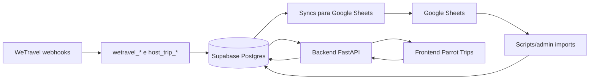

# Runbook do Agente de Banco de Dados

Documento para orientar um agente que consulta, altera ou remove dados do banco do Parrot Trips, sempre com validacao humana antes de qualquer escrita.

Ultima revisao: 2026-09-08.

## Objetivo

O agente deve ajudar a equipe Parrot Trips a investigar e corrigir dados operacionais do aplicativo. Ele pode:

- Consultar dados de viajantes, viagens, profiles, progresso, staff, roteiro, feedbacks e informacoes vindas da WeTravel.
- Propor alteracoes no banco ou nas planilhas.
- Executar alteracoes somente depois de apresentar o plano exato e receber aprovacao humana explicita.
- Verificar o estado antes e depois de qualquer alteracao.

O agente nunca deve:

- Expor `DATABASE_URL`, tokens, JWT secrets ou credenciais Google.
- Rodar `UPDATE`, `DELETE`, `INSERT`, imports destrutivos ou resets sem aprovacao humana.
- Rodar alteracoes sem `WHERE` restritivo.
- Alterar tabelas brutas da WeTravel sem motivo forte e aprovacao explicita.
- Apagar progresso de uma viagem ativa sem explicar impacto.

## Como Acessar

As configuracoes ficam em `backend/.env` para ambiente local e `backend/.env.production` para producao. O banco e Postgres/Supabase, acessado pelo backend via SQLAlchemy async (`postgresql+asyncpg://...`) e por scripts administrativos via `asyncpg`.

Comando padrao para consulta somente leitura em producao:

```bash
set -a
source backend/.env.production
set +a
backend/.venv/bin/python -c '<script_python_somente_leitura>'
```

Padrao Python recomendado:

```python
import os
import asyncio
from sqlalchemy import text
from sqlalchemy.ext.asyncio import create_async_engine

async def main():
    engine = create_async_engine(os.environ["DATABASE_URL"])
    async with engine.connect() as conn:
        result = await conn.execute(
            text("""
                SELECT u.id, u.full_name, u.email, u.phone
                FROM users u
                WHERE regexp_replace(u.phone, '[^0-9]', '', 'g') LIKE :phone
            """),
            {"phone": "%5511999999999%"},
        )
        for row in result.mappings():
            print(dict(row))
    await engine.dispose()

asyncio.run(main())
```

Para escrita, o agente deve primeiro mostrar:

- Registros afetados pelo `SELECT` de pre-checagem.
- SQL ou endpoint exato que sera usado.
- Risco e impacto.
- Plano de rollback ou correcao.
- Pergunta objetiva pedindo aprovacao humana.

## Arquitetura de Dados

O sistema tem quatro fontes/camadas principais:

1. **WeTravel/webhooks**: eventos externos alimentam tabelas `wetravel_*` e views `host_trip_*`.
2. **Google Sheets**: equipe edita conteudo da viagem e operacao de staff em planilhas.
3. **Supabase/Postgres**: fonte estruturada para o aplicativo.
4. **Backend FastAPI**: transforma dados do banco em endpoints consumidos pelo frontend.

Fluxo resumido:



## Identidade, Viagem e Perfil

`users` e a identidade principal. Um usuario pode ser viajante ou staff. A participacao em viagens nao fica no proprio `users`; ela fica em tabelas de ligacao.

- `users`: telefone, nome, email, status e role.
- `trip_travelers`: liga `users.id` a `wetravel_trip_uuid`. Staff tambem pode ter esta ligacao para acessar app como viajante.
- `trip_staff`: liga staff a uma viagem com funcao, foto e bio.
- `traveler_profiles`: dados preenchidos pelo viajante no perfil e no pre departure form. E 1:1 com `trip_travelers`.

Exemplo: achar um viajante e seu perfil:

```sql
SELECT
  u.id AS user_id,
  u.full_name,
  u.email,
  u.phone,
  tt.id AS trip_traveler_id,
  tt.wetravel_trip_uuid,
  tp.*
FROM users u
JOIN trip_travelers tt ON tt.user_id = u.id
LEFT JOIN traveler_profiles tp ON tp.trip_traveler_id = tt.id
WHERE lower(u.full_name) LIKE lower('%luiz%becker%');
```

## Schema Detalhado

### users

Identidade da pessoa no app.

| Coluna | Tipo | Nulo | Observacao |
|---|---|---:|---|
| `id` | uuid | nao | PK |
| `phone` | text | nao | unique, usado no login por OTP |
| `full_name` | text | sim | nome exibido |
| `email` | text | sim | email do usuario |
| `status` | text | nao | status operacional |
| `role` | text | nao | `traveler` ou `staff`, default `traveler` |
| `created_at`, `updated_at` | timestamptz | nao | timestamps |

### otp_codes

Codigos temporarios de login.

| Coluna | Tipo | Nulo | Observacao |
|---|---|---:|---|
| `id` | uuid | nao | PK |
| `phone` | text | nao | telefone solicitado |
| `code` | text | nao | codigo OTP |
| `expires_at` | timestamptz | nao | expiracao |
| `used` | boolean | nao | default `false` |
| `created_at`, `updated_at` | timestamptz | nao | timestamps |

### trip_travelers

Vincula usuario a viagem.

| Coluna | Tipo | Nulo | Observacao |
|---|---|---:|---|
| `id` | uuid | nao | PK |
| `wetravel_trip_uuid` | text | nao | identificador da viagem |
| `user_id` | uuid | nao | FK `users.id` |
| `created_at`, `updated_at` | timestamptz | nao | timestamps |

Constraint: unique (`wetravel_trip_uuid`, `user_id`).

### traveler_profiles

Perfil detalhado e pre departure form. Unique por `trip_traveler_id`.

| Grupo | Colunas |
|---|---|
| Identificacao | `id`, `trip_traveler_id`, `preferred_name`, `avatar_url` |
| Dados pessoais | `date_of_birth`, `gender`, `home_address`, `instagram_handle` |
| Passaporte | `passport_first_name`, `passport_last_name`, `passport_country`, `passport_number`, `passport_issue_date`, `passport_expiration_date` |
| Saude/preferencias | `dietary_restrictions_flag`, `dietary_restrictions_details`, `seasickness_flag` |
| Plus one | `plus_one_flag`, `plus_one_name`, `plus_one_email` |
| Ajuda pre-trip antiga | `needs_flight_help_flag`, `flight_help_details`, `needs_travel_insurance_help_flag`, `unforgettable_trip_details` |
| Pre departure voos | `arrival_date`, `arrival_time`, `arrival_flight`, `departure_date`, `departure_time`, `departure_flight`, `checked_bags` |
| Seguro | `travel_insurance_status`, `travel_insurance_brazil_medical_coverage`, `travel_insurance_provider`, `travel_insurance_policy_number`, `travel_insurance_notes` |
| Quarto | `roommate_status`, `roommate_user_id`, `roommate_email`, `room_configuration`, `roommate_gender_preference` |
| Hospedagem | `extended_stay_help`, `extended_stay_help_details`, `early_check_in_preference` |
| Social/emergencia | `emergency_contact`, `trip_mood`, `social_topic`, `always_up_for`, `final_considerations` |
| Timestamps | `created_at`, `updated_at` |

FKs: `trip_traveler_id -> trip_travelers.id`, `roommate_user_id -> users.id`.

O backend aceita `roommate_user_id` somente se o usuario escolhido tambem estiver em `trip_travelers` na mesma viagem.

### wetravel_trips

Viagens vindas da WeTravel.

Campos principais: `id`, `entity_key`, `source_event_id`, `trip_uuid`, `trip_id`, `title`, `destination`, `currency`, `url`, `listing_status`, `start_date`, `end_date`, `published`, `group_min`, `group_max`, `welcome_message`, `raw_payload_json`, `service_agreement_url`, timestamps de sync.

`trip_uuid` e o identificador usado pelo app, scripts e planilhas.

### wetravel_bookings

Reservas da WeTravel.

Campos principais: `order_id`, `trip_uuid`, `trip_title`, `buyer_id`, `buyer_email`, `buyer_full_name`, `booking_note`, `departure_date`, `trip_end_date`, `total_deposit_amount`, `total_due_amount`, `total_paid_amount`, `total_price_amount`, `participant_count`, `cancelled_participant_count`, `participants_json`, `raw_payload_json`.

Usada para reconstruir participantes, comprador e valores.

### wetravel_order_options

Pacotes e add-ons por pedido.

Campos principais: `order_id`, `trip_uuid`, `option_id`, `trip_option_id`, `option_type`, `option_name`, `active_count`, `cancelled_count`, `price`, `deposit_amount`, `participants_json`, `raw_option_json`.

Constraint: unique (`order_id`, `option_id`).

### host_trip_purchases e host_trip_participants

Views de leitura para consolidar compras.

`host_trip_purchases`: uma linha por compra/pedido.  
`host_trip_participants`: desdobra participantes de `participants_json`.

Campos comuns: `trip_uuid`, `trip_title`, `order_id`, `payment_id`, `transaction_uuid`, `buyer_full_name`, `buyer_email`, `package_names`, `addon_names`, `purchase_status`, `payment_status`, `currency`, `paid_amount`, `pending_amount`, `refunded_amount`, `is_cancelled`, `last_updated_at`.

`host_trip_participants` tambem inclui `participant_id`, `participant_full_name`, `participant_email`.

### traveler_products

Dados derivados de produto por viajante.

| Coluna | Tipo | Observacao |
|---|---|---|
| `id` | uuid | PK |
| `trip_traveler_id` | uuid | unique, FK `trip_travelers.id` |
| `room_type` | text | tipo de quarto exibido no profile |
| `created_at`, `updated_at` | timestamptz | timestamps |

### trip_phases

Fases pre-trip e dias in-trip.

Campos: `id`, `wetravel_trip_uuid`, `parent_phase_id`, `phase_type`, `title`, `subtitle`, `icon`, `short_description`, `detailed_description`, `sort_order`, `starts_at`, `ends_at`, `is_locked_by_default`, `is_visible`, timestamps.

`phase_type` normalmente e `pre-trip` ou `in-trip`. `parent_phase_id` permite hierarquia.

### trip_phase_checklist_items

Checklist dentro de uma fase.

Campos: `id`, `trip_phase_id`, `label`, `description`, `sort_order`, `is_required`, timestamps.

FK: `trip_phase_id -> trip_phases.id`.

### trip_phase_links

Links uteis dentro de uma fase.

Campos: `id`, `trip_phase_id`, `label`, `url`, `sort_order`, timestamps.

### trip_activities

Atividades do roteiro in-trip.

Campos: `id`, `trip_phase_id`, `name`, `activity_type`, `starts_at`, `duration_minutes`, `short_description`, `practical_info`, `amount_brl`, `sort_order`, `address`, `max_checkins`, timestamps.

`max_checkins` controla atividades que exigem mais de uma leitura de QR.

### traveler_checklist_progress

Progresso de checklist por viajante.

Campos: `id`, `trip_traveler_id`, `trip_phase_checklist_item_id`, `is_completed`, `completed_at`, `updated_at`.

Constraint: unique (`trip_traveler_id`, `trip_phase_checklist_item_id`).

### traveler_phase_progress

Progresso manual de fases pre-trip.

Campos: `id`, `trip_traveler_id`, `trip_phase_id`, `is_completed`, `completed_at`, `updated_at`.

Constraint: unique (`trip_traveler_id`, `trip_phase_id`).

No modo `in-trip`, parte do progresso e calculada por data (`starts_at <= hoje`) e nao necessariamente persistida aqui.

### trip_settings

Configuracao operacional da viagem.

Campos: `id`, `trip_uuid`, `mode`, `ideal_pace_phase_id`, `created_at`, `updated_at`.

`mode` controla comportamento da barra de progresso: `pre-trip` ou `in-trip`.

### trip_staff

Staff vinculado a viagem.

Campos: `id`, `wetravel_trip_uuid`, `user_id`, `function`, `photo_url`, `bio`, timestamps.

Constraint: unique (`wetravel_trip_uuid`, `user_id`). FK `user_id -> users.id`.

### staff_tasks

Tarefas operacionais do staff, por fase ou atividade.

Campos: `id`, `trip_phase_id`, `trip_activity_id`, `assigned_to_user_id`, `title`, `description`, `starts_at`, `sort_order`, timestamps.

FKs: `trip_phase_id -> trip_phases.id`, `trip_activity_id -> trip_activities.id`, `assigned_to_user_id -> users.id`.

### activity_participants

Allowlist de participantes para atividades controladas.

Campos: `id`, `trip_activity_id`, `trip_traveler_id`, `status`, `created_at`, `updated_at`.

Constraint: unique (`trip_activity_id`, `trip_traveler_id`).

### activity_checkins

Check-ins reais de QR em atividades.

Campos: `id`, `trip_activity_id`, `trip_traveler_id`, `scanned_by_user_id`, `checked_in_at`, `scan_number`.

Constraint: unique (`trip_activity_id`, `trip_traveler_id`, `scan_number`).

### activity_checkin_scan_events

Auditoria de leituras de QR, inclusive falhas.

Campos: `id`, `trip_activity_id`, `trip_traveler_id`, `scanned_by_user_id`, `status`, `failure_reason`, `raw_payload_hash`, `created_at`.

### trip_announcements e trip_announcement_reads

Comunicados e leitura por usuario.

`trip_announcements`: `id`, `wetravel_trip_uuid`, `title`, `body`, `sent_by_user_id`, `is_anonymous`, `created_at`.  
`trip_announcement_reads`: `id`, `announcement_id`, `user_id`, `read_at`.

Constraint de leitura: unique (`announcement_id`, `user_id`).

### traveler_app_feedback

Feedback livre do viajante sobre o app.

Campos: `id`, `trip_traveler_id`, `feedback`, `created_at`, `updated_at`.

Pode ser sincronizado para a aba `Feedbacks` da planilha de conteudo.

### trip_emergency_contacts, trip_contacts, trip_faqs, trip_cancellation_policies

Conteudo de suporte exibido no app.

- `trip_emergency_contacts`: contatos emergenciais vindos da planilha de conteudo.
- `trip_contacts`: contatos operacionais vindos da planilha de staff.
- `trip_faqs`: perguntas frequentes.
- `trip_cancellation_policies`: politicas de cancelamento.

Todas usam `wetravel_trip_uuid` e `sort_order`.

### trip_recommendations

Recomendacoes locais.

Campos: `id`, `wetravel_trip_uuid`, `name`, `description`, `address`, `photo_url`, `sort_order`, `category`, `neighborhood`, `location`, `highlight`, `price_range`, `rating`, `map_url`, `emoji`, `phone`, `whatsapp_url`, `contact_label`, timestamps.

### webhook_events e sheet_sync_jobs

Infraestrutura de ingestao/sync.

- `webhook_events`: registra payloads recebidos, status de processamento, headers e corpo bruto.
- `sheet_sync_jobs`: fila/controle de escrita em planilha relacionada a eventos.

### transfer_cancel_requests

Registro de solicitacoes de transferencia/cancelamento.

Campos principais: `action`, `user_id`, `traveler_phone`, `traveler_email`, `wetravel_trip_uuid`, `trip_title`, `package_names`, `reason`, `transfer_to`, `created_at`.

## Como o App Usa o Banco

### Login

Endpoints:

- `POST /auth/request-otp`
- `POST /auth/verify-otp`

Tabelas:

- `otp_codes`: cria e valida codigo.
- `users`: identifica ou cria usuario e retorna JWT.

### Viagem ativa

Endpoint: `GET /me/trip`.

Consulta `trip_travelers` do usuario autenticado, junta com `wetravel_trips`, filtra viagem ativa por `end_date >= CURRENT_DATE`, ordena por `start_date`.

### Fases e roteiro

Endpoints:

- `GET /me/trip/phases`
- `GET /me/trip/phases/{phase_id}`

Tabelas:

- `trip_phases`
- `trip_phase_checklist_items`
- `trip_phase_links`
- `trip_activities`

### Progresso

Endpoints:

- `POST /checklist/update`
- `GET /checklist/{trip_id}/{user_id}`
- `POST /phases/complete`
- `GET /phases/{trip_id}/{user_id}`

Tabelas:

- `traveler_checklist_progress`
- `traveler_phase_progress`

### Profile e pre departure

Endpoints:

- `GET /profile/{user_id}?trip_id=<trip_uuid>`
- `PUT /profile/{user_id}?trip_id=<trip_uuid>`
- `GET /profile/trip/{trip_id}/travelers`

Tabelas/views:

- `users`
- `trip_travelers`
- `traveler_profiles`
- `host_trip_participants`
- `wetravel_participant_phones`
- `traveler_products`

Campos vindos da WeTravel/profile read-only no app: pacote, add-ons, valor pago e tipo de quarto. Campos editaveis pelo viajante ficam em `traveler_profiles`.

### Staff app e QR

Endpoints principais:

- `GET /me/staff/trip`
- QR/check-in em `/me/staff/...`

Tabelas:

- `trip_staff`
- `staff_tasks`
- `trip_activities`
- `activity_participants`
- `activity_checkins`
- `activity_checkin_scan_events`

### Conteudo auxiliar

Endpoints:

- `GET /me/team`
- `GET /me/emergency-contacts`
- `GET /me/recommendations`
- `GET /me/faq`
- `GET /me/cancellation-policy`
- `GET /me/announcements`
- `POST /me/announcements/{announcement_id}/read`
- `POST /me/app-feedback`

Tabelas:

- `trip_staff`
- `trip_emergency_contacts`
- `trip_recommendations`
- `trip_faqs`
- `trip_cancellation_policies`
- `trip_announcements`
- `trip_announcement_reads`
- `traveler_app_feedback`

## Planilhas Linkadas

### Trip Content

Planilha: `Parrot Trips - Conteudo de Viagens`  
Env var: `TRIP_CONTENT_SHEET_ID`  
ID: `1N1B66s1-K4DDf2_863frmhnpF6LRZB_ww60uax0gKZM`  
Link: https://docs.google.com/spreadsheets/d/1N1B66s1-K4DDf2_863frmhnpF6LRZB_ww60uax0gKZM

Abas principais:

| Aba | Origem/destino | Descricao |
|---|---|---|
| `Viagens` | referencia | `trip_uuid`, nome e datas. Tambem pode carregar `service_agreement_url` quando presente em importadores recentes. |
| `Fases` | Sheets -> DB | fases pre-trip. |
| `Checklist` | Sheets -> DB | itens de checklist por fase. |
| `Links` | Sheets -> DB | links por fase. |
| `Roteiro` | Sheets -> DB e DB -> Sheets | dias e atividades in-trip; sync de `address` e `max_checkins` pode escrever de volta na planilha. |
| `Emergency Contacts` | Sheets -> DB | contatos emergenciais. |
| `Recomendacoes` | Sheets -> DB | recomendacoes locais. |
| `FAQ` | Sheets -> DB | perguntas frequentes. |
| `Cancellation Policy` | Sheets -> DB | politicas de cancelamento. |
| `Feedbacks` | DB -> Sheets | feedbacks enviados no app. |

Cabecalhos criados pelo script `create_trip_sheets.py`:

```text
Viagens: trip_uuid, nome_da_viagem, data_inicio, data_fim
Fases: trip_uuid, ordem, fase, titulo, subtitulo, icone, descricao_curta, descricao_completa
Checklist: trip_uuid, fase, ordem, label, obrigatorio
Links: trip_uuid, fase, ordem, label, url
Roteiro: trip_uuid, dia, data, dia_titulo, dia_subtitulo, dia_icon, dia_descricao_curta, dia_descricao_completa, atividade_nome, atividade_tipo, atividade_horario, atividade_duracao_min, atividade_descricao_curta, atividade_info_pratica, atividade_preco_brl
```

### Staff Content

Planilha: `Parrot Trips - Staff`  
Env var: `STAFF_CONTENT_SHEET_ID`  
ID: `1iVv9k45F3dacjYEwR4TsIuGuFtFmVgN3y0ueghvNWiI`  
Link: https://docs.google.com/spreadsheets/d/1iVv9k45F3dacjYEwR4TsIuGuFtFmVgN3y0ueghvNWiI

Abas:

| Aba | Origem/destino | Descricao |
|---|---|---|
| `Viagens` | referencia | viagens disponiveis. |
| `Contatos` | Sheets -> DB | contatos operacionais para `trip_contacts`. |
| `Staff` | Sheets -> DB e DB -> Sheets | cria/atualiza usuarios staff, `trip_staff` e tambem link em `trip_travelers`. Pode receber `photo_url` e `bio`. |
| `Tarefas Staff` | Sheets -> DB e DB -> Sheets | tarefas por dia/atividade e staff responsavel. |
| `Participantes Atividades` | Sheets -> DB e DB -> Sheets | allowlist de atividades controladas. |

Cabecalhos criados pelo script `create_staff_sheets.py`:

```text
Viagens: trip_uuid, nome_da_viagem, data_inicio, data_fim
Contatos: trip_uuid, category, name, role, phone, sort_order
Staff: phone, nome, funcao, trip_uuid
Tarefas Staff: trip_uuid, dia, atividade_nome, staff_phone, titulo, descricao, sort_order
Participantes Atividades: trip_uuid, dia, atividade_nome, traveler_phone, status
```

## Scripts e Endpoints Administrativos

Scripts locais:

- `backend/scripts/create_trip_sheets.py`: cria planilha de conteudo.
- `backend/scripts/import_trip_content.py`: importa conteudo da Trip Content Sheet para Supabase.
- `backend/scripts/create_staff_sheets.py`: cria planilha de staff.
- `backend/scripts/import_staff_content.py`: importa staff, contatos, tarefas e participantes controlados.
- `backend/scripts/reset_traveler_progress.py`: reseta progresso.
- `backend/scripts/populate_rich_recommendations.py`: atualiza recomendacoes ricas na planilha e no banco.

Endpoints admin:

| Endpoint | Efeito |
|---|---|
| `GET /admin/trips` | lista viagens ativas |
| `POST /admin/trips/import` | importa `Fases`, `Checklist`, `Links`, `Roteiro` |
| `POST /admin/trips/reset-content` | apaga fases e filhos de uma viagem |
| `POST /admin/trips/start-trip` | limpa progresso de fase e muda `trip_settings.mode` para `in-trip` |
| `POST /admin/trips/reset-trip` | limpa checklist e fases; uso de teste |
| `POST /admin/trips/import-faq` | importa FAQ |
| `POST /admin/trips/import-cancellation-policy` | importa politica |
| `POST /admin/trips/import-emergency-contacts` | importa contatos emergenciais |
| `POST /admin/trips/import-recommendations` | importa recomendacoes |
| `POST /admin/trips/import-contacts` | importa contatos da staff sheet |
| `POST /admin/trips/import-staff` | importa staff |
| `POST /admin/trips/import-staff-tasks` | importa tarefas staff |
| `POST /admin/trips/import-activity-participants` | importa allowlist |
| `POST /admin/trips/sync-to-sheet` | escreve `address` e `max_checkins` do DB para `Roteiro` |
| `POST /admin/trips/sync-staff-to-sheet` | escreve tarefas/participantes do DB para staff sheet |
| `POST /admin/trips/sync-feedback-to-sheet` | escreve feedbacks para `Feedbacks` |
| `POST /admin/users/set-role` | muda `users.role` por telefone |

## Operacoes Comuns

### Consultar colega de quarto

```sql
SELECT
  u.full_name AS traveler_name,
  u.email AS traveler_email,
  u.phone AS traveler_phone,
  tt.wetravel_trip_uuid,
  tp.roommate_status,
  tp.roommate_user_id,
  ru.full_name AS selected_roommate_name,
  ru.email AS selected_roommate_email,
  ru.phone AS selected_roommate_phone,
  tp.roommate_email AS freeform_roommate_email,
  tp.room_configuration,
  tp.updated_at
FROM users u
JOIN trip_travelers tt ON tt.user_id = u.id
LEFT JOIN traveler_profiles tp ON tp.trip_traveler_id = tt.id
LEFT JOIN users ru ON ru.id = tp.roommate_user_id
WHERE tt.wetravel_trip_uuid = :trip_uuid
  AND lower(u.full_name) LIKE lower(:name);
```

Interprete assim:

- `roommate_user_id` preenchido: viajante selecionou outro usuario da mesma viagem.
- `roommate_email` preenchido e `roommate_user_id` vazio: viajante informou email livre, mas nao vinculou usuario cadastrado.
- `roommate_status = 'No, please match me with someone.'`: precisa matching manual.

### Alterar nome, email ou telefone de usuario

Pre-checagem:

```sql
SELECT id, full_name, email, phone, role, status
FROM users
WHERE phone = :phone OR lower(email) = lower(:email);
```

Escrita somente com aprovacao:

```sql
UPDATE users
SET full_name = :full_name,
    email = :email,
    updated_at = now()
WHERE id = :user_id;
```

Depois:

```sql
SELECT id, full_name, email, phone, role, status, updated_at
FROM users
WHERE id = :user_id;
```

### Vincular usuario a uma viagem

Pre-checagem:

```sql
SELECT * FROM users WHERE id = :user_id;
SELECT trip_uuid, title, start_date, end_date FROM wetravel_trips WHERE trip_uuid = :trip_uuid;
SELECT * FROM trip_travelers WHERE user_id = :user_id AND wetravel_trip_uuid = :trip_uuid;
```

Escrita com aprovacao:

```sql
INSERT INTO trip_travelers (id, wetravel_trip_uuid, user_id, created_at, updated_at)
VALUES (gen_random_uuid(), :trip_uuid, :user_id, now(), now())
ON CONFLICT (wetravel_trip_uuid, user_id) DO NOTHING;
```

### Corrigir campo do pre departure form

Sempre filtre por `trip_traveler_id`, nao apenas por nome.

```sql
SELECT tp.*
FROM traveler_profiles tp
JOIN trip_travelers tt ON tt.id = tp.trip_traveler_id
JOIN users u ON u.id = tt.user_id
WHERE tt.wetravel_trip_uuid = :trip_uuid
  AND u.id = :user_id;
```

Escrita com aprovacao:

```sql
UPDATE traveler_profiles
SET arrival_date = :arrival_date,
    arrival_time = :arrival_time,
    arrival_flight = :arrival_flight,
    updated_at = now()
WHERE trip_traveler_id = :trip_traveler_id;
```

### Vincular roommate selecionado

Pre-checagem obrigatoria:

```sql
SELECT tt.id, u.id AS user_id, u.full_name, u.email, u.phone
FROM trip_travelers tt
JOIN users u ON u.id = tt.user_id
WHERE tt.wetravel_trip_uuid = :trip_uuid
  AND u.id IN (:traveler_user_id, :roommate_user_id);
```

So aprove se ambos aparecem na mesma viagem.

```sql
UPDATE traveler_profiles
SET roommate_status = 'Yes',
    roommate_user_id = :roommate_user_id,
    roommate_email = NULL,
    updated_at = now()
WHERE trip_traveler_id = :trip_traveler_id;
```

### Resetar progresso

Impacto:

- `traveler_phase_progress`: reseta fases completas.
- `traveler_checklist_progress`: reseta checklist completo.

Pre-checagem:

```sql
SELECT COUNT(*) FROM trip_travelers WHERE wetravel_trip_uuid = :trip_uuid;
SELECT COUNT(*)
FROM traveler_phase_progress tpp
JOIN trip_travelers tt ON tt.id = tpp.trip_traveler_id
WHERE tt.wetravel_trip_uuid = :trip_uuid;
SELECT COUNT(*)
FROM traveler_checklist_progress tcp
JOIN trip_travelers tt ON tt.id = tcp.trip_traveler_id
WHERE tt.wetravel_trip_uuid = :trip_uuid;
```

Prefira endpoints admin existentes:

- `POST /admin/trips/start-trip`: preserva checklist, apaga progresso de fase e muda para `in-trip`.
- `POST /admin/trips/reset-trip`: apaga checklist e fase; usar para teste ou com aprovacao forte.

### Importar conteudo da planilha

`POST /admin/trips/import` ou `backend/scripts/import_trip_content.py` substitui conteudo de fases e atividades da viagem.

Risco: o import apaga e recria fases, checklist, links e atividades. Isso pode invalidar progresso associado as fases antigas.

Pre-checagem:

```sql
SELECT phase_type, COUNT(*)
FROM trip_phases
WHERE wetravel_trip_uuid = :trip_uuid
GROUP BY phase_type;
```

Aprovacao humana deve mencionar explicitamente:

- `trip_uuid`.
- Planilha usada.
- Abas importadas.
- Se viajantes ja estao usando o app.
- Impacto sobre progresso.

## Regras de Validacao Humana

Antes de escrita, o agente deve responder neste formato:

```text
Vou alterar:
- Ambiente: producao
- Tabela(s): ...
- Filtro: ...
- Linhas esperadas: ...
- SQL/endpoint: ...
- Risco: ...
- Verificacao depois: ...

Posso executar esta alteracao?
```

Depois da aprovacao e execucao:

```text
Resultado:
- Linhas afetadas: ...
- Antes: ...
- Depois: ...
- Observacao: ...
```

## Checklist de Seguranca

- Sempre descobrir `trip_uuid` antes de alterar dados de viagem.
- Sempre resolver `user_id` e `trip_traveler_id`; nomes podem repetir.
- Sempre usar transacao para multiplos comandos relacionados.
- Sempre fazer `SELECT` antes e depois.
- Para `DELETE`, preferir `WITH deleted AS (...) SELECT count(*)` ou capturar quantidade retornada.
- Para import/reset, preferir endpoint/script ja existente.
- Para dados vindos de WeTravel, tratar tabelas `wetravel_*` como fonte externa e evitar edicao manual.
- Para planilhas, lembrar que nova importacao pode sobrescrever correcao feita diretamente no banco.
- Nunca colar segredos no chat, no doc ou em logs.

