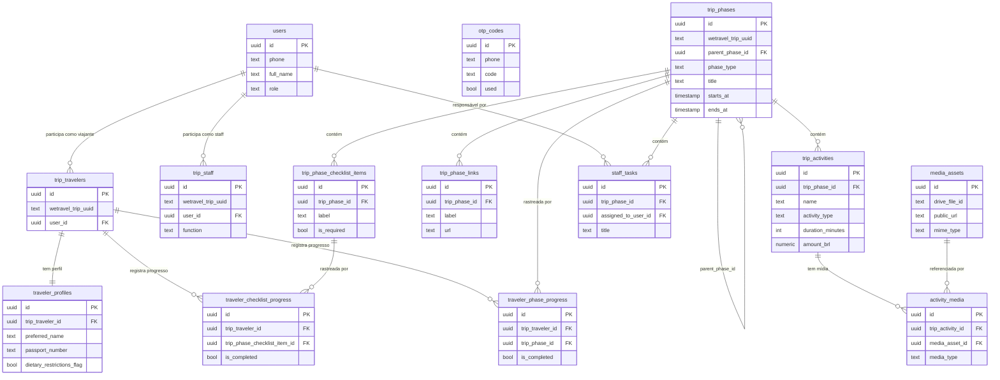
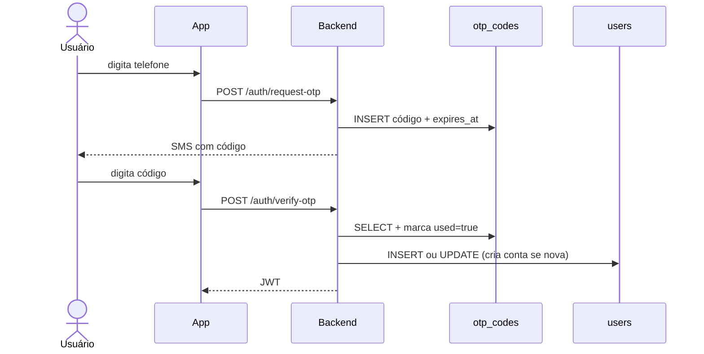
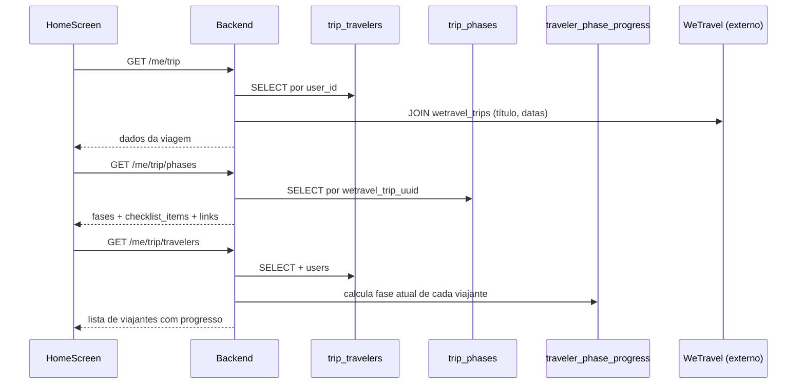
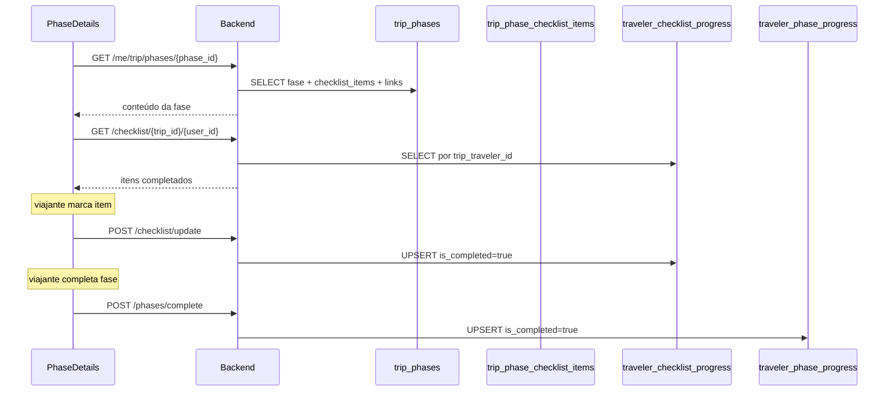
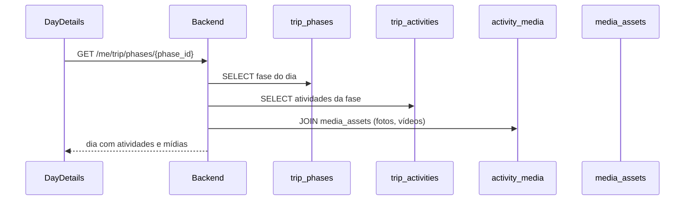
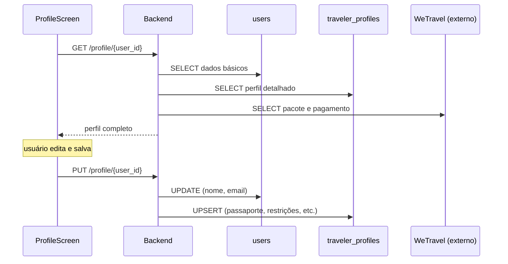
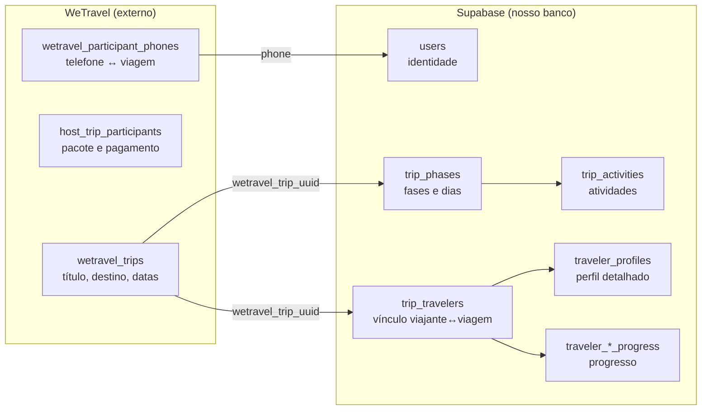

# Supabase — Modelo de Dados e Fluxo

## Tabelas

### Autenticação

| Tabela | Colunas principais | Função |
|--------|--------------------|--------|
| `users` | id, phone, full_name, email, role (traveler/staff) | Identidade do usuário |
| `otp_codes` | phone, code, expires_at, used | Códigos OTP temporários para login via SMS |

### Vinculação viajante ↔ viagem

| Tabela | Colunas principais | Função |
|--------|--------------------|--------|
| `trip_travelers` | wetravel_trip_uuid, user_id | Liga um user a uma viagem externa |
| `trip_staff` | wetravel_trip_uuid, user_id, function | Liga usuário staff a uma viagem |
| `traveler_profiles` | trip_traveler_id, passaporte, restrições, etc. | Perfil detalhado — 1:1 com trip_travelers |

### Conteúdo da viagem

| Tabela | Colunas principais | Função |
|--------|--------------------|--------|
| `trip_phases` | wetravel_trip_uuid, phase_type, title, starts_at, ends_at, parent_phase_id | Fases/dias (pre-trip / in-trip), hierárquicas |
| `trip_phase_checklist_items` | trip_phase_id, label, is_required | Itens de checklist de cada fase |
| `trip_phase_links` | trip_phase_id, label, url | Links de recursos por fase |
| `trip_activities` | trip_phase_id, name, activity_type, starts_at, amount_brl | Atividades dentro de cada fase |
| `staff_tasks` | trip_phase_id, assigned_to_user_id, title | Tarefas operacionais do staff por fase |

### Mídia

| Tabela | Colunas principais | Função |
|--------|--------------------|--------|
| `media_assets` | drive_file_id, public_url, mime_type | Referências a arquivos do Google Drive |
| `activity_media` | trip_activity_id, media_asset_id, media_type | Liga mídias a atividades |

### Progresso do viajante

| Tabela | Colunas principais | Função |
|--------|--------------------|--------|
| `traveler_checklist_progress` | trip_traveler_id, trip_phase_checklist_item_id, is_completed | Itens de checklist completados por viajante |
| `traveler_phase_progress` | trip_traveler_id, trip_phase_id, is_completed | Fases completadas por viajante |

---

## Relações entre tabelas

---

## Fluxo por tela

### Login

### HomeScreen

### PhaseDetails (pre-trip)

### DayDetails (in-trip)

### ProfileScreen

---

## Origem dos dados: Supabase vs WeTravel

